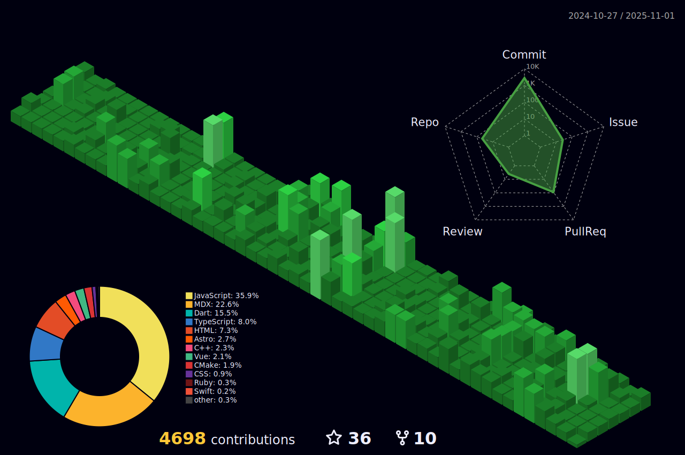

<h4 align="center">💼 Software Engineer - 🏭 Flutter Developer FullStack</h4>

  

  <!--
  
  
  
  
  -->

✨ I write simple, stupid and hence, readable "okay" codes with less WTFs/min from code reviews - mostly in [Flutter](https://github.com/flutter), [Node.js](https://github.com/nodejs).

<!-- ✨ <b>Work Domain:</b> SaaS, Mobile Solutions (App, AR), Cloud Solutions (CRM, ERP, HRM), mobile Sales Force Automation (mSFA)
-->

✨ **Industries:** Offshore IT Industry, Digital Agency, Health, Education, Finance.

Things you should know -

- 🔭 **Currently working on:** Dart & Flutter
- 🌱 **Getting better at:** Flutter, Swift, Kotlin, Agile Software Development, Technical Product Management
<!-- - 🤔 <b>Exploring:</b> Niche Service Industries, Cloud Solutions (CRM & ERP)
- 👯 <b>Experimenting on:</b> Digitalizing Brand Incubation, Sales Force Automation -->
<!-- - 💬 <b>Ask me about:</b> Software Architectural Patterns, Android Vitals, SaaS, Offline-first App Optimizations -->
- 📫 **Reach me out:** Shoot a mail at 
<!-- - ⚡ <b>Rolling in godspeed:</b> Redefining EdTech in :bangladesh: -->
<!-- - 🔭 <b>Currently working on:</b> Kotlin, GraphQL, IBM MFP, AWS, Django REST
- 🌱 <b>Getting better at:</b> Jamstack, Scala, Agile Software Development, Technical Product Management
- 🤔 <b>Exploring:</b> Niche Service Industries, Cloud Solutions (CRM & ERP)
- 👯 <b>Experimenting on:</b> Digitalizing Brand Incubation, Sales Force Automation
- 💬 <b>Ask me about:</b> Software Architectural Patterns, Android Vitals, SaaS, Offline-first App Optimizations
- 📫 <b>Reach me out:</b> Shoot a mail at <a href="mailto:contact@saad.ninja" target="_blank">contact@saad.ninja</a>
- ⚡ <b>Rolling in godspeed:</b> Redefining EdTech in :bangladesh: -->

  
  

## **_Featured Projects_**

<!--

  
🚀 <b><h3>HTTP EXCEPTIONS (0+ ⭐)</h3></b>

  

    

      
    

  

  <h4><b>Highlights</b> ✨</h4>

✅ **Job Scheduling Framework** running on **Dart VM**.  
✅ **Easily schedules** with a combination of **Job**, **Step**, and **Task**.  
✅ Supports **job scheduling in [Cron](https://en.wikipedia.org/wiki/Cron)** format.  
✅ Supports **convenient logging functions** as a standard.  
✅ Supports the **parallel processing**.  
✅ Supports **conditional branching** of schedules.  
✅ Supports the **customizable retry feature**.

- [Repository](https://github.com/batch-dart/batch.dart)
- [Pub.dev](https://pub.dev/packages/batch)

#### Others
-->

- [nomina básico en colombia (Vue.js v3)](https://github.com/tech-andgar/nomina)
- [solid-example (Dart & Typescript)](https://github.com/tech-andgar/solid-example)
<!--
- [http_exception (Dart) [WIP]](https://github.com/tech-andgar/http_exception)
- [clean_architecture_counter (Flutter & Dart) [WIP]](https://github.com/tech-andgar/clean_architecture_counter)
- [project](https://github.com/user/project) (10+ ⭐)
-->

## **_Experiences / Technical Skills_**

  

    <b><em>⚡️ Languages</em></b>
  

  

    <b><em>Level novice or no more worked</em></b>
  

<!--

-->

 

    
<b><em>⚡️ IDE / Editor</em></b>

  
<b><em>⚡️ Data</em></b>

<!--

-->

  
<b><em>⚡️ Frameworks / Platforms</em></b>

<!--

-->

  
<b><em>⚡️ Tools</em></b>

  
<b><em>Worked (Alphabetical order)</em></b>

  
  
  
  
  
  
  
  
  
  
  
  
  
  
  
  
  
  
  
  
  
  
  
  
  
  
  
  
  
  
  
  
  
  
  
  
  
  
  
  
  
  
  
  
  
  
  
  
  
  
  
  
  
  
  
  
  
  
  
  

  

---

## **_Activities_**

  
⚡️ Github Status

  

  

  

 

  

  

<!--START_SECTION:lapras-card-->

<!--END_SECTION:lapras-card-->

  
📕 Latest Blog Posts

<!-- BLOG-POST-LIST:START -->
- [Solving Artifacts with `ImageFilter.blur` in Flutter on Android, iOS and macOS](https://tech-andgar.me/posts/solving-artifacts-imagefilter-blur-flutter/)
- [Innovation in Accessibility: Real Inclusion or Barrier for the Deaf Community?](https://tech-andgar.me/posts/innovation-accessibility-sign-language-deaf-community/)
- [Error Handling in Dart: Should You Use `try/catch`, Return Values, or Functional Approaches?](https://tech-andgar.me/posts/dart-try-catch-vs-records-values-vs-functional-approaches-for-error-handling/)
- [Talks](https://tech-andgar.me/talks/)
- [`http_status` Dart Package: A Comprehensive Guide](https://tech-andgar.me/posts/dart-http_status-package/)
<!-- BLOG-POST-LIST:END -->

---

## **_Do you know..._**

<!-- PHOTO-DAY-NASA:START - Do not remove or modify this section -->

    
    

        <h4>SpaceX Rocket Launch Plume over California</h4>
        <time>2025-02-17</time>
        
What's happened to the sky? Last Monday, the photogenic launch plume from a SpaceX rocket launch created quite a spectacle over parts of southern California and Arizona.  Looking at times like a giant space fish, the impressive rocket launch from Vandenberg Air Force Base near Lompoc, California, was so bright because it was backlit by the setting Sun. The Falcon 9 rocket successfully delivered to low Earth orbit 23 Starlink communications satellites.  The plume from the first stage is seen on the right, while the soaring upper stage rocket is seen at the apex of the plume toward the left. Venus appears at the top of the frame, while a bright streetlight shines on the far right.  The featured image was captured toward the west after sunset from near Phoenix, Arizona.

        <strong><em>NASA</em></strong>
    

  

  <!-- PHOTO-DAY-NASA:END -->

---

## **_Sponsoring_**

I'm looking for sponsors to support my open source development, I appreciate your support! :)

  

<!--
**tech-andgar/tech-andgar** is a ✨ _special_ ✨ repository because its `README.md` (this file) appears on your GitHub profile.

Here are some ideas to get you started:

- 🔭 I'm currently working on ...
- 🌱 I'm currently learning ...
- 👯 I'm looking to collaborate on ...
- 🤔 I'm looking for help with ...
- 💬 Ask me about ...
- 📫 How to reach me: ...
- 😄 Pronouns: ...
- ⚡ Fun fact: ...
-->
